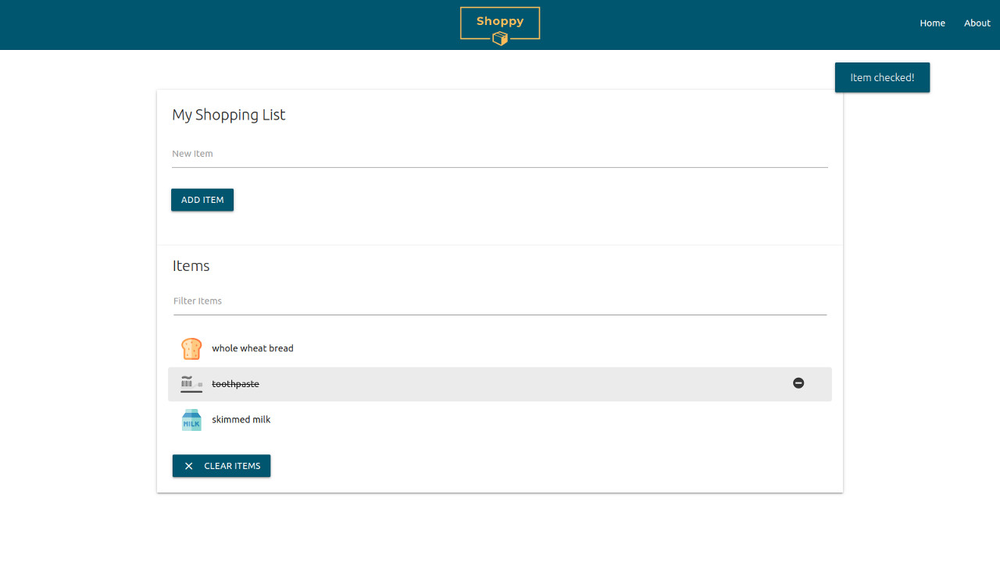

# Shoppy

Simple application for making shopping lists.

## Functionality

- Add items to list
- Remove items from list
- Check items off list
- Clear all items
- Filter through items

>All items are stored to local storage.
>The application also remembers which items have been checked or removed. 

>Common items such as *coffee* or *shampoo* have pre-defined icons associated with them for a visually pleasant user experience.

## Built With

- [HTML](https://developer.mozilla.org/en-US/docs/Web/HTML)
- [CSS](https://developer.mozilla.org/en-US/docs/Web/CSS)
- [JavaScript](https://developer.mozilla.org/en-US/docs/Web/JavaScript)
- [Materialize](https://materializecss.com/)

## Add More Icons

Add any **svg** image to the `img` directory with a suitable name such as **peach.svg**. Then in `app.js`, add the file name given to the added image to the `itemIcons` array.

`const itemIcons = ['egg', 'bread', ..., 'peach']`